<html lang="ja">
<head>
    <meta charset="UTF-8">
    <meta name="viewport" content="width=device-width, initial-scale=1.0">
    <title>SDGs Matching</title>
    
</head>
<body>
    <header>
        <h1>SDGs Matching</h1>
    </header>

    <main>
        <section id="sdgs-goals">
            <h2>SDGsの目標</h2>
            

                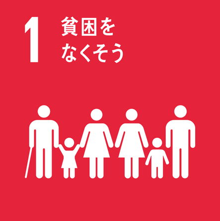
                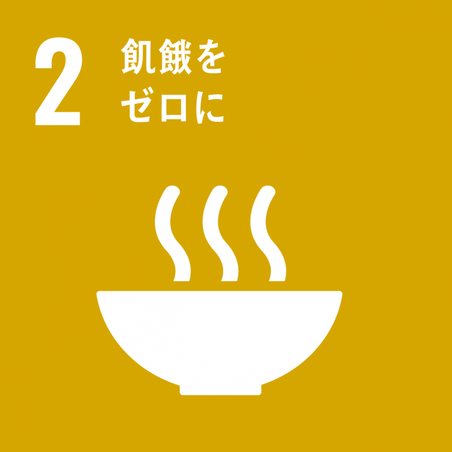
                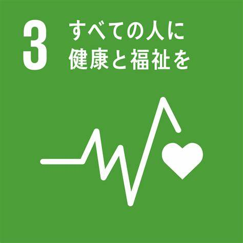
                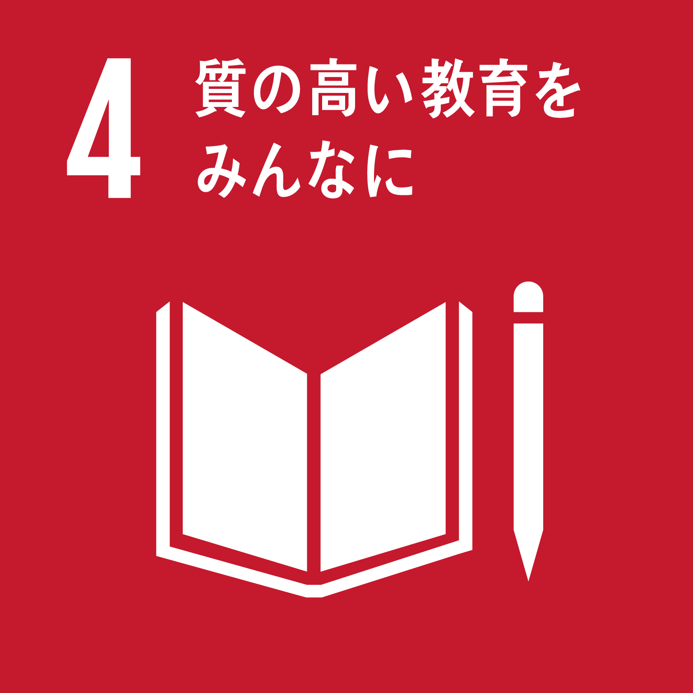
                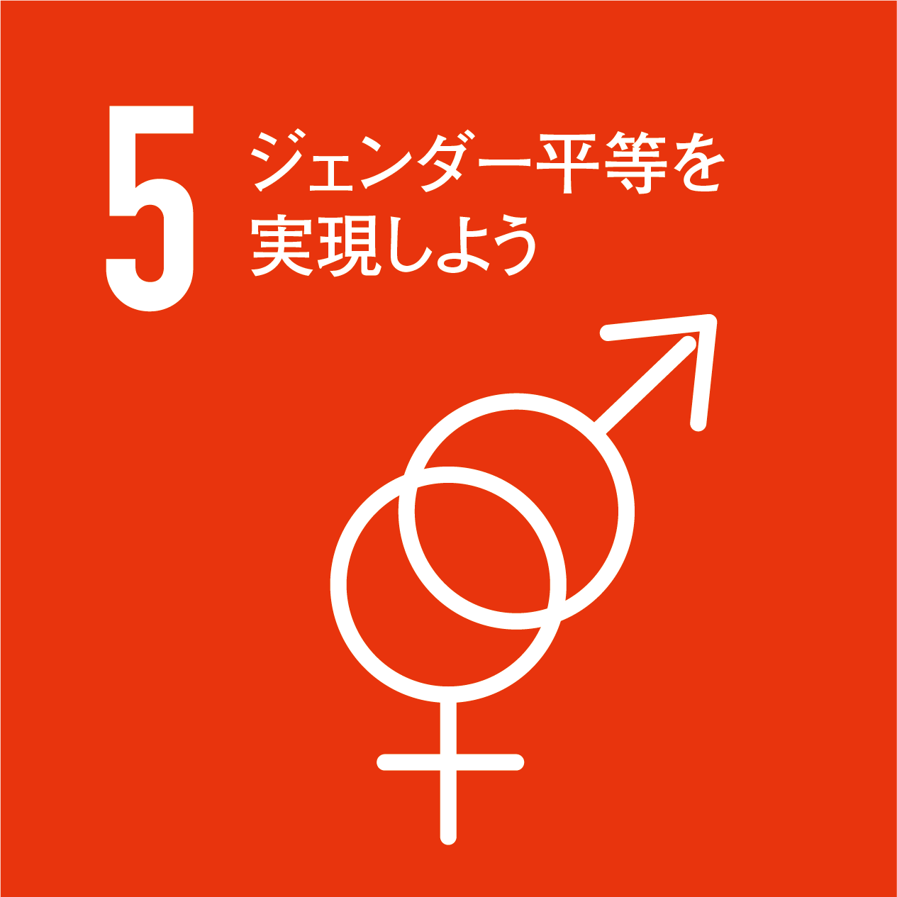
                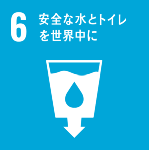
                
                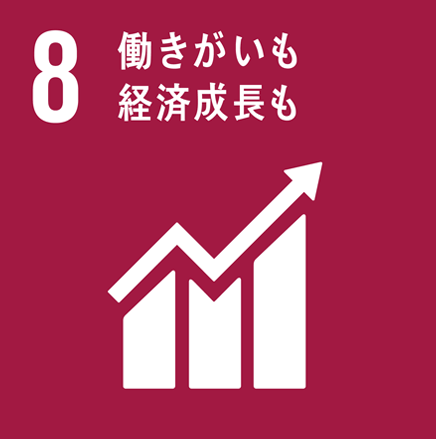
                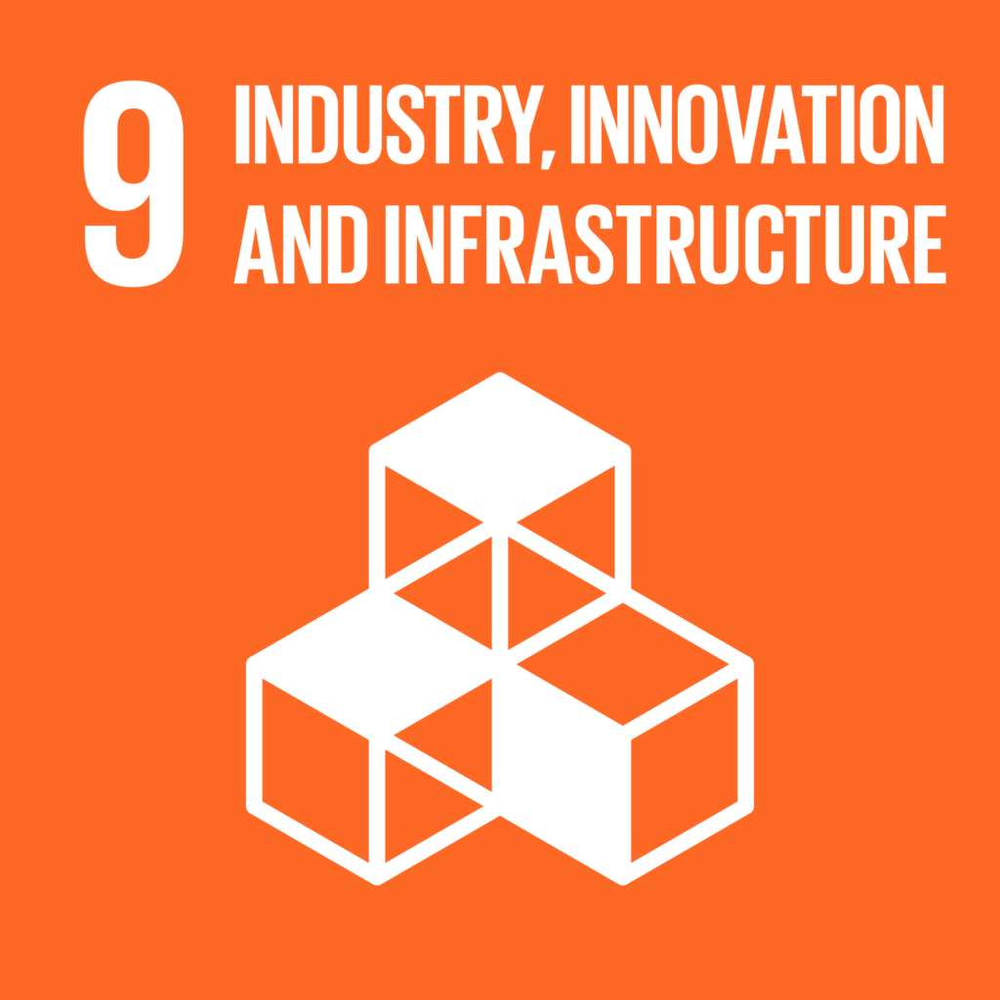
                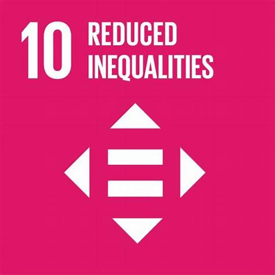
                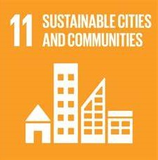
                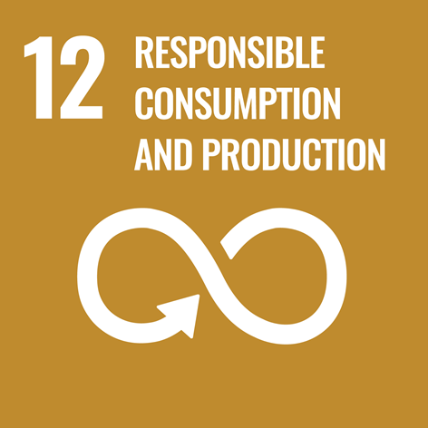
                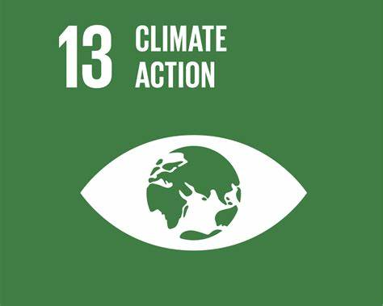
                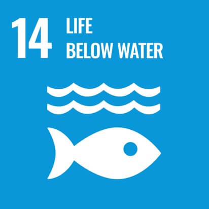
                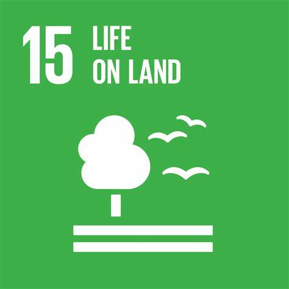
                
                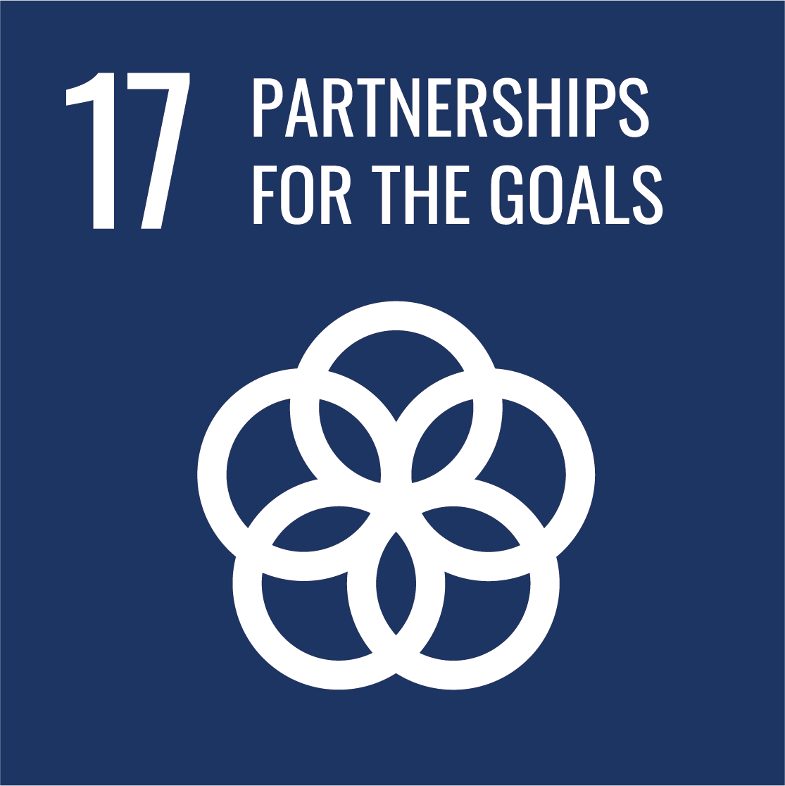
            

        </section>

        <section id="companies-list">
            <h2>関連する企業</h2>
            

        </section>
    </main>

    
</body>
</html>
